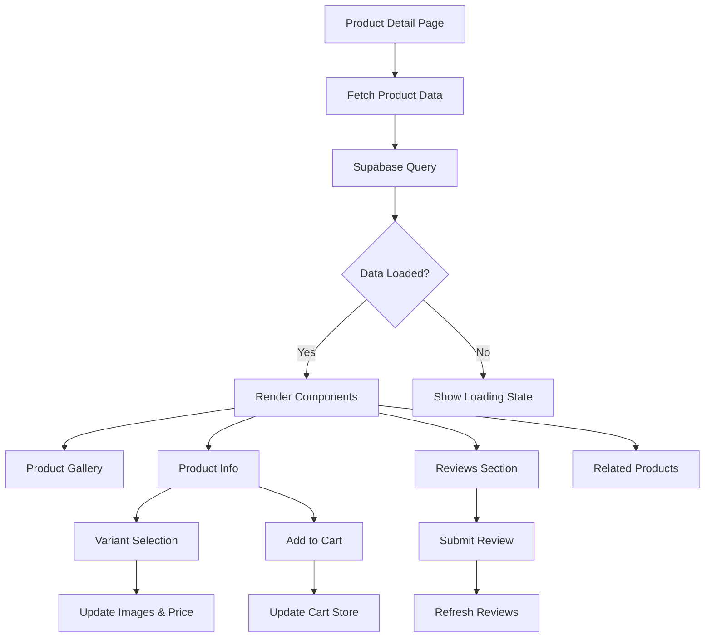

# Design Document

## Overview

The product detail page redesign creates a modern, professional e-commerce experience that maximizes conversion while providing users with all necessary information to make confident purchasing decisions. The design follows contemporary UI/UX patterns seen in leading e-commerce platforms, with a focus on visual appeal, usability, and performance across all devices.

The architecture emphasizes component modularity, allowing each section of the product page to be independently developed, tested, and optimized. The design leverages Next.js 14 app router capabilities, React Server Components where appropriate, and client-side interactivity for dynamic features.

## Architecture

### High-Level Structure

```
Product Detail Page
├── Breadcrumb Navigation
├── Product Gallery Section
│   ├── Main Image Display (with zoom)
│   ├── Thumbnail Navigation
│   └── Fullscreen Lightbox
├── Product Information Section
│   ├── Title & Price Display
│   ├── Rating Summary
│   ├── Variant Selector
│   ├── Action Buttons (Cart, Wishlist, Share)
│   ├── Trust Badges
│   └── Shipping Information
├── Product Details Tabs
│   ├── Description
│   ├── Specifications
│   └── Shipping & Returns
├── Reviews Section
│   ├── Rating Distribution
│   ├── Review List
│   └── Review Form
└── Related Products Section
```

### Component Hierarchy

The page will be structured as a main page component that orchestrates several specialized sub-components:

1. **ProductDetailPage** (Main Container)
   - Handles data fetching and state management
   - Coordinates between child components
   - Manages URL parameters and navigation

2. **ProductGallery** (Image Display)
   - Manages image selection and display
   - Implements zoom and lightbox functionality
   - Handles touch gestures for mobile

3. **ProductInfo** (Information Panel)
   - Displays product metadata
   - Manages variant selection
   - Handles add-to-cart and wishlist actions

4. **ProductTabs** (Detailed Information)
   - Organizes description, specs, and policies
   - Implements tab or accordion interface

5. **ReviewsSection** (Social Proof)
   - Displays aggregate ratings
   - Lists individual reviews
   - Provides review submission form

6. **RelatedProducts** (Recommendations)
   - Fetches and displays related items
   - Implements carousel for mobile

### Data Flow



## Components and Interfaces

### 1. ProductGallery Component

**Purpose**: Display product images with interactive navigation and zoom capabilities

**Props Interface**:
```typescript
interface ProductGalleryProps {
  images: string[];
  productTitle: string;
  onImageChange?: (index: number) => void;
}
```

**Key Features**:
- Thumbnail navigation with active state
- Main image display with hover zoom
- Fullscreen lightbox with keyboard navigation
- Swipe gestures for mobile
- Lazy loading for performance
- Image preloading for smooth transitions

**State Management**:
- `selectedImageIndex`: Current displayed image
- `isLightboxOpen`: Fullscreen mode toggle
- `zoomPosition`: Coordinates for zoom effect

### 2. ProductInfo Component

**Purpose**: Display product information and handle user interactions

**Props Interface**:
```typescript
interface ProductInfoProps {
  product: Product;
  variants: ProductVariant[];
  selectedVariant: ProductVariant | null;
  onVariantChange: (variant: ProductVariant) => void;
  onAddToCart: () => void;
  onAddToWishlist: () => void;
}
```

**Key Features**:
- Sticky header on mobile scroll
- Dynamic price calculation
- Variant selector with visual feedback
- Stock status indicator
- Action buttons with loading states
- Share functionality

### 3. VariantSelector Component

**Purpose**: Allow users to select product variants with visual feedback

**Props Interface**:
```typescript
interface VariantSelectorProps {
  variants: ProductVariant[];
  selectedVariant: ProductVariant | null;
  onSelect: (variant: ProductVariant) => void;
  type: 'color' | 'material' | 'size';
}
```

**Key Features**:
- Color swatches for color variants
- Button groups for material/size
- Disabled state for out-of-stock
- Hover preview
- Tooltip with variant details

### 4. ProductTabs Component

**Purpose**: Organize detailed product information in an accessible format

**Props Interface**:
```typescript
interface ProductTabsProps {
  description: string;
  specifications?: Record<string, string>;
  shippingInfo?: string;
  returnPolicy?: string;
}
```

**Key Features**:
- Tab interface for desktop
- Accordion interface for mobile
- Smooth transitions
- Deep linking to specific tabs
- Keyboard navigation

### 5. ReviewsSection Component

**Purpose**: Display customer reviews and enable review submission

**Props Interface**:
```typescript
interface ReviewsSectionProps {
  productId: string;
  averageRating: number;
  totalReviews: number;
  onReviewSubmit: () => void;
}
```

**Key Features**:
- Rating distribution chart
- Sortable review list
- Pagination or infinite scroll
- Review form with validation
- Helpful vote system

### 6. RelatedProducts Component

**Purpose**: Suggest related products to increase discovery

**Props Interface**:
```typescript
interface RelatedProductsProps {
  currentProductId: string;
  categoryId?: string;
  limit?: number;
}
```

**Key Features**:
- Horizontal carousel on mobile
- Grid layout on desktop
- Product card with quick actions
- Lazy loading
- Skeleton loading states

### 7. TrustBadges Component

**Purpose**: Display trust indicators to build customer confidence

**Props Interface**:
```typescript
interface TrustBadgesProps {
  badges: Array<{
    icon: React.ReactNode;
    text: string;
    description?: string;
  }>;
}
```

### 8. ShareButtons Component

**Purpose**: Enable social sharing of products

**Props Interface**:
```typescript
interface ShareButtonsProps {
  productUrl: string;
  productTitle: string;
  productImage: string;
  productPrice: number;
}
```

## Data Models

### Extended Product Type

```typescript
interface ProductDetailData extends Product {
  // Existing fields from Product type
  // Additional computed fields
  effectivePrice: number;
  discountPercentage: number;
  averageRating: number;
  totalReviews: number;
  isInStock: boolean;
  estimatedDelivery: string;
  relatedProducts: Product[];
}
```

### Gallery State

```typescript
interface GalleryState {
  images: string[];
  selectedIndex: number;
  isLightboxOpen: boolean;
  isZoomed: boolean;
  zoomPosition: { x: number; y: number };
}
```

### Variant Selection State

```typescript
interface VariantState {
  selectedVariant: ProductVariant | null;
  availableColors: string[];
  availableMaterials: string[];
  stockStatus: 'in_stock' | 'low_stock' | 'out_of_stock';
}
```


## Correctness Properties

*A property is a characteristic or behavior that should hold true across all valid executions of a system-essentially, a formal statement about what the system should do. Properties serve as the bridge between human-readable specifications and machine-verifiable correctness guarantees.*

### Property Reflection

After analyzing all acceptance criteria, several properties can be consolidated to avoid redundancy:

- Properties related to responsive design (viewport-specific layouts) are difficult to test programmatically and will be validated through manual testing
- Visual animation properties are inherently difficult to test and will rely on visual regression testing
- Many conditional rendering properties follow similar patterns and can be grouped by behavior type

The following properties represent unique, testable behaviors that provide comprehensive validation coverage:

### Image Gallery Properties

**Property 1: Gallery renders with thumbnails**
*For any* product with multiple images, the gallery component should render both a main image display and thumbnail navigation elements
**Validates: Requirements 1.1**

**Property 2: Thumbnail selection updates main image**
*For any* thumbnail index clicked, the main image display should update to show the image at that index
**Validates: Requirements 1.2**

**Property 3: Hover triggers zoom state**
*For any* main image, hovering should toggle the zoom state to true
**Validates: Requirements 1.3**

**Property 4: Swipe gestures navigate images**
*For any* swipe direction (left/right), the selected image index should change accordingly (increment/decrement)
**Validates: Requirements 1.4**

**Property 5: Navigation elements conditional on image count**
*For any* product, navigation arrows and indicators should only render when image count is greater than 1
**Validates: Requirements 1.5**

**Property 6: Click opens lightbox**
*For any* main image click event, the lightbox state should toggle to open
**Validates: Requirements 1.6**

### Product Information Properties

**Property 7: Required information elements present**
*For any* product, the page should render title, price, and discount information elements
**Validates: Requirements 2.1**

**Property 8: Discount display completeness**
*For any* product where discount_price < base_price, the display should include original price, discounted price, and percentage savings
**Validates: Requirements 2.2**

**Property 9: Long descriptions show expansion control**
*For any* product description exceeding a character threshold, a "Read More" control should be rendered
**Validates: Requirements 2.4**

**Property 10: Features render as list**
*For any* product with features array, each feature should render as a list item with an icon
**Validates: Requirements 2.5**

### Variant Selection Properties

**Property 11: Variants render selectors**
*For any* product with variants, variant selector components should be rendered
**Validates: Requirements 3.1**

**Property 12: Variant selection updates dependent values**
*For any* variant selection, the displayed images, price, and stock status should update to reflect the selected variant
**Validates: Requirements 3.2**

**Property 13: Out of stock variants disabled**
*For any* variant with stock_quantity = 0, the variant selector should be disabled and show unavailable status
**Validates: Requirements 3.3**

**Property 14: Color variants render as swatches**
*For any* variant with a color attribute, it should render as a color swatch element
**Validates: Requirements 3.4**

**Property 15: Hover shows variant preview**
*For any* variant option hover event, a preview of that variant should be displayed
**Validates: Requirements 3.5**

### Action Button Properties

**Property 16: Action buttons present**
*For any* product page, both "Add to Cart" and "Add to Wishlist" buttons should be rendered
**Validates: Requirements 4.1**

**Property 17: Add to cart updates store**
*For any* "Add to Cart" click, the cart store should be called with the product and cart count should increment
**Validates: Requirements 4.2**

**Property 18: Wishlist toggle state**
*For any* wishlist button click, the wishlist state should toggle between added and not added
**Validates: Requirements 4.3**

**Property 19: Out of stock changes button text**
*For any* product with stock_quantity = 0, the button text should be "Notify When Available" instead of "Add to Cart"
**Validates: Requirements 4.4**

### Reviews Properties

**Property 20: Rating displays as stars**
*For any* product with a rating value, the rating should render as star visualization
**Validates: Requirements 5.1**

**Property 21: Reviews show count and distribution**
*For any* product with reviews, the total count and rating distribution should be displayed
**Validates: Requirements 5.2**

**Property 22: Individual reviews include required fields**
*For any* review displayed, it should include rating, date, and user name
**Validates: Requirements 5.3**

**Property 23: Review form has required fields**
*For any* product page, the review form should include rating and comment input fields
**Validates: Requirements 5.4**

**Property 24: Many reviews trigger pagination**
*For any* product with reviews exceeding a threshold, pagination or "Load More" controls should be rendered
**Validates: Requirements 5.5**

### Related Products Properties

**Property 25: Related products section renders**
*For any* product, a related products section should be displayed
**Validates: Requirements 6.1**

**Property 26: Related products have required data**
*For any* related product displayed, it should include image, title, and price
**Validates: Requirements 6.2**

**Property 27: Related product click navigates**
*For any* related product click, navigation should be triggered to that product's detail page URL
**Validates: Requirements 6.3**

**Property 28: Empty related products shows fallback**
*For any* product with no related products in the same category, popular or featured products should be displayed instead
**Validates: Requirements 6.5**

### Navigation Properties

**Property 29: Breadcrumbs render hierarchy**
*For any* product with category, breadcrumb navigation should display Home > Category > Product hierarchy
**Validates: Requirements 7.1**

**Property 30: Breadcrumb click navigates**
*For any* breadcrumb link click, navigation should be triggered to the corresponding page
**Validates: Requirements 7.2**

**Property 31: Back link present**
*For any* product page, a "Back to Products" link should be rendered
**Validates: Requirements 7.4**

### Trust and Information Properties

**Property 32: Trust badges render**
*For any* product page, trust badge elements should be displayed
**Validates: Requirements 8.1**

**Property 33: Shipping info displays when available**
*For any* product with shipping information, delivery time and costs should be rendered
**Validates: Requirements 8.2**

**Property 34: Stock status displays**
*For any* product, stock availability status should be displayed
**Validates: Requirements 8.3**

**Property 35: Payment methods render as icons**
*For any* available payment method, it should render as an icon element
**Validates: Requirements 8.4**

**Property 36: Guarantee info displays when present**
*For any* product with guarantee information, it should be displayed prominently
**Validates: Requirements 8.5**

### Accessibility Properties

**Property 37: Touch targets meet minimum size**
*For any* interactive element, it should have a minimum touch target size of 44px
**Validates: Requirements 9.5**

**Property 38: Reduced motion respected**
*For any* animation, it should be disabled when user has prefers-reduced-motion preference enabled
**Validates: Requirements 10.5**

### Sharing Properties

**Property 39: Share buttons present**
*For any* product page, social sharing buttons should be rendered
**Validates: Requirements 11.1**

**Property 40: Share click generates correct URL**
*For any* share button click, it should generate a URL with the correct platform and pre-filled product information
**Validates: Requirements 11.2**

**Property 41: Copy provides confirmation**
*For any* copy link action, visual confirmation feedback should be triggered
**Validates: Requirements 11.3**

**Property 42: Share data includes required fields**
*For any* share action, the shared data should include product image, title, and price
**Validates: Requirements 11.4**

**Property 43: Native share used when available**
*For any* mobile device with navigator.share API, the native share functionality should be called
**Validates: Requirements 11.5**

### Specifications Properties

**Property 44: Specifications render in organized format**
*For any* product with specifications, they should render in a tabbed or accordion interface
**Validates: Requirements 12.1**

**Property 45: Tab click changes active state**
*For any* tab click, the active tab state should update to the clicked tab
**Validates: Requirements 12.2**

**Property 46: Specifications formatted as key-value pairs**
*For any* specification displayed, it should be formatted as a key-value pair
**Validates: Requirements 12.3**

## Error Handling

### Data Fetching Errors

**Product Not Found**:
- Display custom 404 page with navigation back to products
- Log error for monitoring
- Suggest related or popular products

**Network Errors**:
- Show retry button with exponential backoff
- Display cached data if available
- Provide offline indicator

**Image Loading Errors**:
- Fallback to placeholder image
- Retry loading with different CDN endpoint
- Log failed image URLs for investigation

### User Input Errors

**Review Submission Failures**:
- Display inline error messages
- Preserve user input for retry
- Validate rating and comment before submission

**Add to Cart Failures**:
- Show toast notification with error
- Retry automatically once
- Provide manual retry option

**Variant Selection Errors**:
- Validate stock before allowing selection
- Show clear unavailability message
- Suggest alternative variants

### State Management Errors

**Invalid Variant State**:
- Reset to first available variant
- Log inconsistency for debugging
- Prevent checkout with invalid state

**Cart Synchronization Issues**:
- Reconcile with server state
- Show warning if quantities adjusted
- Provide refresh option

## Testing Strategy

### Unit Testing

Unit tests will focus on individual component logic and user interactions:

**Component Rendering Tests**:
- Test that components render with required props
- Verify conditional rendering logic
- Check default prop values

**Interaction Tests**:
- Test button click handlers
- Verify form submission logic
- Check state updates on user actions

**Utility Function Tests**:
- Test price calculation functions
- Verify discount percentage calculations
- Test image URL transformations

**Example Unit Tests**:
```typescript
// Test variant selection updates price
test('selecting variant updates displayed price', () => {
  const product = createMockProduct();
  const variant = product.variants[1];
  render(<ProductInfo product={product} />);
  
  fireEvent.click(screen.getByText(variant.color));
  
  expect(screen.getByText(`₹${product.base_price + variant.price_adjustment}`)).toBeInTheDocument();
});

// Test out of stock button text
test('out of stock product shows notify button', () => {
  const product = createMockProduct({ stock_quantity: 0 });
  render(<ProductInfo product={product} />);
  
  expect(screen.getByText('Notify When Available')).toBeInTheDocument();
  expect(screen.queryByText('Add to Cart')).not.toBeInTheDocument();
});
```

### Property-Based Testing

Property-based tests will verify universal behaviors across many randomly generated inputs using **fast-check** library for TypeScript/JavaScript.

**Configuration**:
- Minimum 100 iterations per property test
- Custom generators for Product and ProductVariant types
- Shrinking enabled for minimal failing examples

**Test Organization**:
- Each correctness property maps to one property-based test
- Tests tagged with property number and requirement reference
- Grouped by component/feature area

**Example Property Tests**:
```typescript
// Property 12: Variant selection updates dependent values
test('Property 12: variant selection updates all dependent values', () => {
  fc.assert(
    fc.property(
      productWithVariantsGenerator(),
      fc.nat(),
      (product, variantIndex) => {
        const variant = product.variants[variantIndex % product.variants.length];
        const { result } = renderHook(() => useProductState(product));
        
        act(() => {
          result.current.selectVariant(variant);
        });
        
        // All dependent values should reflect selected variant
        expect(result.current.selectedVariant).toEqual(variant);
        expect(result.current.displayedImages).toEqual(variant.images);
        expect(result.current.currentPrice).toBe(product.base_price + variant.price_adjustment);
        expect(result.current.stockStatus).toBe(variant.stock_quantity > 0 ? 'in_stock' : 'out_of_stock');
      }
    ),
    { numRuns: 100 }
  );
});

// Property 8: Discount display completeness
test('Property 8: discount display includes all required elements', () => {
  fc.assert(
    fc.property(
      productWithDiscountGenerator(),
      (product) => {
        fc.pre(product.discount_price < product.base_price);
        
        const { container } = render(<ProductInfo product={product} />);
        
        // Should display all three elements
        const originalPrice = container.querySelector('[data-testid="original-price"]');
        const discountedPrice = container.querySelector('[data-testid="discounted-price"]');
        const savingsPercent = container.querySelector('[data-testid="savings-percent"]');
        
        expect(originalPrice).toBeTruthy();
        expect(discountedPrice).toBeTruthy();
        expect(savingsPercent).toBeTruthy();
        
        // Verify calculations
        const expectedPercent = Math.round(((product.base_price - product.discount_price) / product.base_price) * 100);
        expect(savingsPercent?.textContent).toContain(`${expectedPercent}%`);
      }
    ),
    { numRuns: 100 }
  );
});
```

**Custom Generators**:
```typescript
// Generator for products with variants
const productWithVariantsGenerator = () => fc.record({
  id: fc.uuid(),
  title: fc.string({ minLength: 5, maxLength: 100 }),
  base_price: fc.integer({ min: 100, max: 100000 }),
  discount_price: fc.option(fc.integer({ min: 50, max: 99999 })),
  variants: fc.array(variantGenerator(), { minLength: 1, maxLength: 10 })
});

// Generator for product variants
const variantGenerator = () => fc.record({
  id: fc.uuid(),
  color: fc.constantFrom('Gold', 'Silver', 'Rose Gold', 'Platinum'),
  material: fc.constantFrom('14K', '18K', '22K', 'Platinum'),
  price_adjustment: fc.integer({ min: -5000, max: 50000 }),
  stock_quantity: fc.integer({ min: 0, max: 100 }),
  images: fc.array(fc.webUrl(), { minLength: 1, maxLength: 5 })
});
```

### Integration Testing

Integration tests will verify component interactions and data flow:

**Gallery and Variant Integration**:
- Test that variant selection updates gallery images
- Verify thumbnail navigation works with variant images

**Cart and Wishlist Integration**:
- Test adding products with variants to cart
- Verify wishlist state persists across navigation

**Reviews and Product Integration**:
- Test review submission updates product rating
- Verify review list refreshes after submission

### Visual Regression Testing

Use Playwright or Chromatic for visual regression:

**Responsive Design Validation**:
- Capture screenshots at mobile, tablet, desktop breakpoints
- Verify layout changes appropriately
- Check sticky elements behavior

**Animation and Transition Validation**:
- Verify smooth transitions between images
- Check modal open/close animations
- Validate hover effects

### Accessibility Testing

**Automated Accessibility Tests**:
- Run axe-core on all page states
- Verify ARIA labels and roles
- Check keyboard navigation

**Manual Accessibility Tests**:
- Screen reader testing
- Keyboard-only navigation
- Color contrast verification

### Performance Testing

**Metrics to Monitor**:
- Largest Contentful Paint (LCP) < 2.5s
- First Input Delay (FID) < 100ms
- Cumulative Layout Shift (CLS) < 0.1
- Time to Interactive (TTI) < 3.5s

**Optimization Strategies**:
- Image lazy loading and optimization
- Code splitting for heavy components
- Prefetching related products
- Caching product data

## Implementation Notes

### Responsive Breakpoints

```typescript
const breakpoints = {
  mobile: '0px',
  tablet: '768px',
  desktop: '1024px',
  wide: '1440px'
};
```

### Animation Timing

```typescript
const animations = {
  fast: '150ms',
  normal: '300ms',
  slow: '500ms',
  easing: 'cubic-bezier(0.4, 0.0, 0.2, 1)'
};
```

### Image Optimization

- Use Next.js Image component for automatic optimization
- Implement responsive images with srcset
- Lazy load images below the fold
- Preload hero/main product image
- Use WebP format with fallbacks

### State Management

- Use Zustand for cart and wishlist (existing)
- Local component state for UI interactions
- React Query for server state and caching
- URL state for shareable configurations

### SEO Considerations

- Dynamic meta tags for product title, description, price
- Structured data (JSON-LD) for product schema
- Open Graph tags for social sharing
- Canonical URLs for variant pages
- Image alt text for all product images

### Performance Optimizations

- Server-side render initial product data
- Client-side hydration for interactive features
- Prefetch related products on hover
- Debounce variant selection updates
- Virtualize long review lists
- Implement intersection observer for lazy loading

### Browser Support

- Modern browsers (Chrome, Firefox, Safari, Edge)
- Mobile browsers (iOS Safari, Chrome Mobile)
- Graceful degradation for older browsers
- Polyfills for missing features (Intersection Observer, etc.)
